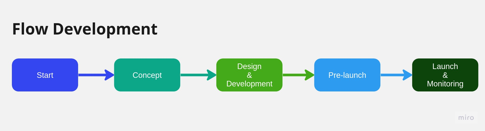

<h1 align="center">
  Arch PBA
</h1>
  <p align="center">The Project uses a tech stack with Go, MySQL, and several packages or frameworks.</p>

### Contents:
- [Contents:](#contents)
  - [Quick start 🚀](#quick-start-)
  - [Architecture Layers of the Project 🔰](#architecture-layers-of-the-project-)
  - [The Complete Project Folder Structure 📁](#the-complete-project-folder-structure-)
  - [API documentation of Monolithic Classification 📄](#api-documentation-of-monolithic-classification-)
  - [How to Define UseCase](#how-to-define-usecase)
  - [Arch PBA ERD 🔨](#arch-pba-erd-)
  - [Arch PBA Tech Design 🔨](#arch-pba-tech-design-)
  - [TODO 🗒](#todo-)

#### Quick start 🚀

**Generate a new migration file**
```
$ make migrate-new name=add_table
```

**Create database (if necessary) and migrate to the latest version**

```
$ make migrate-up
```

**Rollback the most recent migration**

```
$ make migrate-down
```

**List applied and pending migrations**

```
$ make migrate-status
```

**Database migration with script**

```bash
> ./scripts/db-migration.sh [args]

Arguments:
(required) -h: database host.
(required) -u: database username.
(optional) -p: database port. Default: 5432
(optional) -d: database name. Default: arch_db
(required) -a: dbmate action. [up|down|create|new|wait|migrate|status|dump|rollback]
```

**Run service**

> ```bash
> make build
> make run
> # or
> make run env=?
> ```




#### Architecture Layers of the Project 🔰 
- REST Layer
- Business Layer
- Presistance Layer
 


#### The Complete Project Folder Structure 📁 

A quick look at the top-level files and directories you'll see in this project.

```
    .
    ├── cmd
    ├── config
    ├── database
    ├── internal
    │   ├── controllers
    │   │   ├── brand_hotel
    │   │   ├── hotel
    │   │   └── room
    │   ├── entity
    │   ├── model
    │   │   └── api
    │   ├── outbound
    │   ├── repository
    │   │   ├── brand_hotel
    │   │   ├── hotel
    │   │   └── room
    │   ├── routes
    │   ├── scripts
    │   ├── service
    │   │   ├── brand_hotel
    │   │   ├── hotel
    │   │   └── room
    │   ├── state
    │   └── util
    │       ├── exception
    │       ├── exceptioncode
    │       ├── helper
    │       ├── httphelper
    │       ├── json
    │       ├── logger
    │       ├── password
    │       ├── queryhelper
    │       ├── random
    │       └── validator
    ├── scripts
    ├── .gitignore
    ├── go.mod
    ├── go.sum
    ├── Makefile
    └── README.md

```

1. **`/cmd/main.go`**: This file is the starting point for the application, which starts the server.

2. **`/database`**: This is for connect the Database.

3. **`/config`**: This directory contains the viper configration and the property files.

4. **`/internal`**: This directory contains persentation layer, business layer nd presistance layer.

5. **`/internal/controller`**: This directory contains the controllers that the router/handlers are configured to call as *Persentation Layer*.

6. **`/internal/entity`**: This directory contains entity.

7. **`/internal/model`**: This directory contains api request and response.

8. **`/internal/outbound`**: This directory contains file related third party.

9. **`/internal/repository`**: This directory contains respository file and presistance layer as *Presistance Layer*.

10. **`/internal/routes`**: This directory chouses the router.

11. **`/internal/service`**: This directory service files which configure the route and start the server as *Businees Layer*

12. **`/internal/state`**: This directory contains all the states such as status type and etc.

13. **`/internal/util`**: This directory contains all the util classes used throughout the app.

14. **`/scripts`**: This directory contains file migration and seeding the data.

15. **`Makefile`**: This file allows the use of make to run tests, build locally, and is used to build in the pipeline. This can be expanded as needed

16. **`go.mod/go.sum`**: These files are generated by Go Mod dependency management and can be learned about in the documentation link provided above.

17. **`.gitignore`**: This file tells git which files it should not track / not maintain a version history for.

18. **`README.md`**: A text file containing useful reference information about your project.

#### API documentation of Monolithic Classification 📄

#### How to Define UseCase
Based on the product requirement we have cms admin which need to serve endpoint api like this:
- **Find All Hotel** `GET http://{host}/api/v2/hotel`

<a href="" target="_blank">
    
</a>


#### Arch PBA ERD 🔨
[*Arch PBA Entity Relationship Diagram*](https://dbdiagram.io/d/PBA-Template-651cdf87ffbf5169f0fbf4a3)


#### Arch PBA Tech Design 🔨
[*Tech Design*](https://docs.google.com/document/d/1R5GSpwRj9xLKzdYa4bwE81nu0x5mer5T/edit?usp=sharing&ouid=100809718456748840710&rtpof=true&sd=true)

#### TODO 🗒
- Improvement based on feedback from Reviewing
- Improve to Hexagonal Architecture
